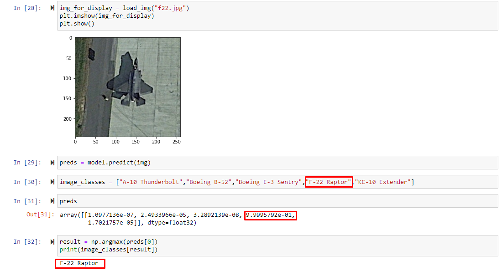

# Military Aircraft Classification Project

Project prepared with VGG16 algorithm.

## Description

Prediction system with deep learning method using VGG16 Algorithm. Recognition of aircraft in military hangar by artificial intelligence method trained from data set. VGG16 algorithm MTARSI dataset was used.

## Method (Technique)
The object recognition algorithm CNN was used. Supported by VGG16.

### Requirements

* Anaconda
* Jupyter Notebook
* Python3

### Installation Requirements

* Jupyter Notebook

### Screenshot

## Help

If you encounter an error, feel free to let us know!

## Team
 
 [@dogukankurnaz](https://github.com/dogukankurnaz)
 
 
## Version

* 1.0
    * Published.

## Licence
[MIT](https://choosealicense.com/licenses/mit/)

